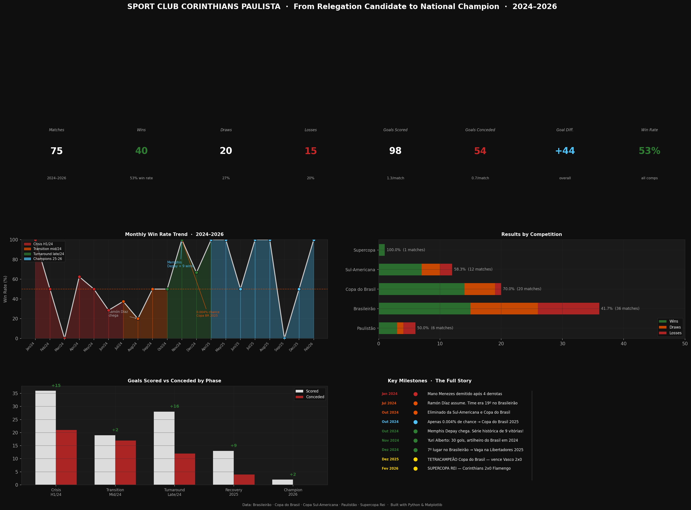

# Corinthians Performance Analytics (2024–2026)
### From Relegation Candidate to National Champion



---

## The Story

In late October 2024, Sport Club Corinthians Paulista was 18th in the
Brasileirão — deep in the relegation zone — with only a **0.004% probability**
of qualifying for the Copa do Brasil 2025.

By February 2026, Corinthians had:
- Survived relegation with a historic run of **9 consecutive wins**
- Finished **7th in the Brasileirão**, securing a Libertadores spot
- Won the **Copa do Brasil 2025** (Tetracampeão), beating Vasco 2–0
- Won the **Supercopa Rei 2026**, beating Flamengo 2–0

This project uses Python to analyze and visualize that full journey across
**75 matches** and **5 competitions**.

---

## Dashboard Overview

The dashboard contains 4 main sections:

**KPI Cards** — Total matches, wins, draws, losses, goals scored,
goals conceded, goal difference and overall win rate.

**Monthly Win Rate Trend** — Line chart showing performance month by month
from January 2024 to February 2026, colored by phase (crisis, transition,
turnaround, champions).

**Results by Competition** — Stacked horizontal bar chart comparing
wins/draws/losses across Brasileirão, Copa do Brasil, Sul-Americana,
Paulistão and Supercopa Rei.

**Goals Scored vs Conceded by Phase** — Bar chart showing how the
defensive and offensive numbers evolved across each phase.

**Key Milestones Timeline** — Visual timeline of the most important
moments of the journey.

---

## Key Insights

| Phase | Period | Win Rate | Goals Scored | Goals Conceded |
|-------|--------|----------|--------------|----------------|
| Crisis | H1 2024 | 28% | 1.0/match | 1.4/match |
| Transition | Mid 2024 | 43% | 1.1/match | 1.0/match |
| Turnaround | Late 2024 | 78% | 1.6/match | 0.6/match |
| Recovery | 2025 | 70% | 1.4/match | 0.5/match |
| Champion | 2026 | 100% | 2.0/match | 0.0/match |

- Defense improved **before** offense — goals conceded dropped first
- Memphis Depay's arrival was the clear inflection point
- Yuri Alberto finished 2024 as Brazil's top scorer with 30 goals
- The 0.004% Copa do Brasil qualification chance became a **title**

---

## How to Run

**1. Clone the repository:**
```bash
git clone https://github.com/YOUR_USERNAME/corinthians-performance-analytics
cd corinthians-performance-analytics
```

**2. Install dependencies:**
```bash
pip3 install pandas matplotlib numpy
```

**3. Run the dashboard:**
```bash
python3 corinthians_dashboard.py
```

The dashboard will open on screen and save a PNG to your Downloads folder.

---

## Tech Stack

| Tool | Usage |
|------|-------|
| Python 3.14 | Core language |
| Pandas | Data manipulation and aggregation |
| Matplotlib | Data visualization and dashboard layout |
| NumPy | Numerical calculations |

---

## Project Structure
